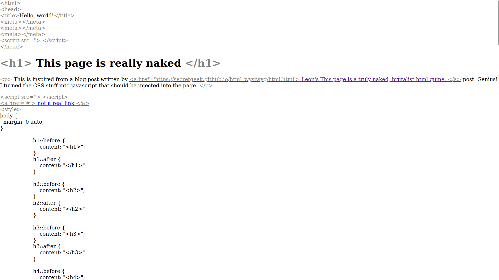

# Make It Naked

It's just a page after all, right?

This is a simple script that should reveal the HTML tags that constitute a web page.

Example below


## How it works

It uses CSS pseudo elements `::before` and `::after` in order to write the HTML name tag before and after the element.

Credits to [Leon for his blog post](https://secretgeek.github.io/html_wysiwyg/html.html)

It looks something like 
```css
/* say we are trying to style a div tag */
div::before {
    content: "<div>";
}

div::after {
    content: "</div>";
}
```

;)
